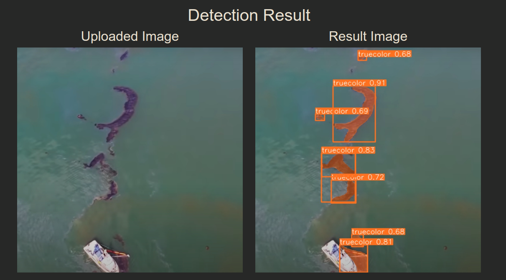

# Oil Spill Maps

Цель данной работы - разработка автоматизированного решения для разведки водной местности на предмет наличия разлива нефти на основе сегментации, с использованием космических снимков высокого разрешения, предоставляемых компанией SR Data. Такое решение позволит оперативно обнаруживать и отслеживать потенциальные утечки нефти, снижая время реакции и минимизируя вредные последствия для окружающей среды и экономики. Автоматизация процесса разведки на основе сегментации позволит эффективно обрабатывать большие объемы космических данных и предоставлять точную информацию о местоположении и масштабах загрязнения, что в свою очередь поможет принимать обоснованные решения по ликвидации утечек и предотвращению экологических катастроф.

Задачи:
* Сбор данных
* Анализ открытых данных
* Разметка данных
* Аугментация данных
* Формирование тренировочного и валидационного датасетов
* Проверка гипотез


## 1. Installation and startup

**Locally**

Установить необходимые пакеты и зависимости:
```Bash
pip install -r requirements.txt
```
Загрузить обученную модель с Git Large File Storage:

```Bash
git lfs install
git lfs pull
```
После установки зависимостей можно запустить сервис:

```Bash
python app.py
```

Подключение дб
```Bash
python db_setup.py
```

## 2. Пример работы


